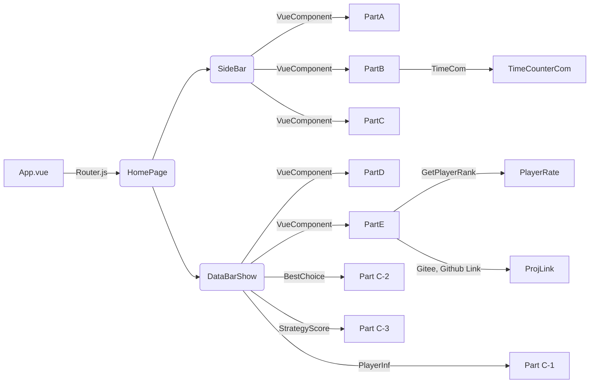
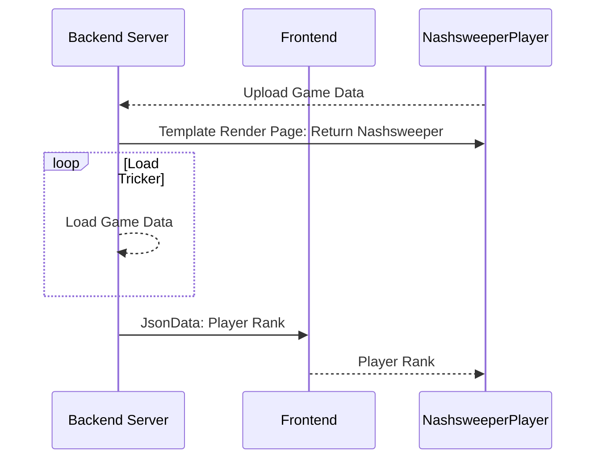

# Nashsweeper
## 0x00 Introduction
Nash equilibrium is a core concept of game theory. This repo shows a playful introduction of Nash equilibrium and designs a game named Nashsweeper, which is a game designed to find the pure strategy. 

## 0x01 How to use?
### In dev mode
* If you want to run this project, you should start the backend service firstly by changing your terminal path to [nashsweeper-banckend](./nashsweeper-backend/) and reading the [readme file](nashsweeper-backend/README.md) carefully. Then you should run the frontend service by changing your disk to [nashsweeper-front](./nashsweeper-front/) and follow the [readme file](nashsweeper-front/README.md) step by step.
* What deserves your attention most is that both the backend and frontend services ports cannot be taken by other applications, or you won't be able to run it correctly.
### In Docker Micro-service mode
Coming soon!
## 0x02 Software Architecture
### Frontend User Interface Render

### Backend DataProcess

